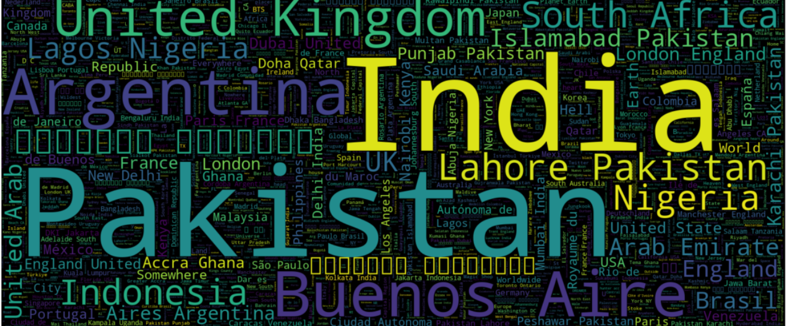
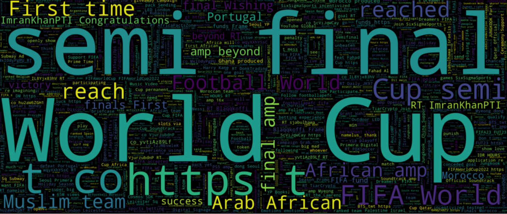
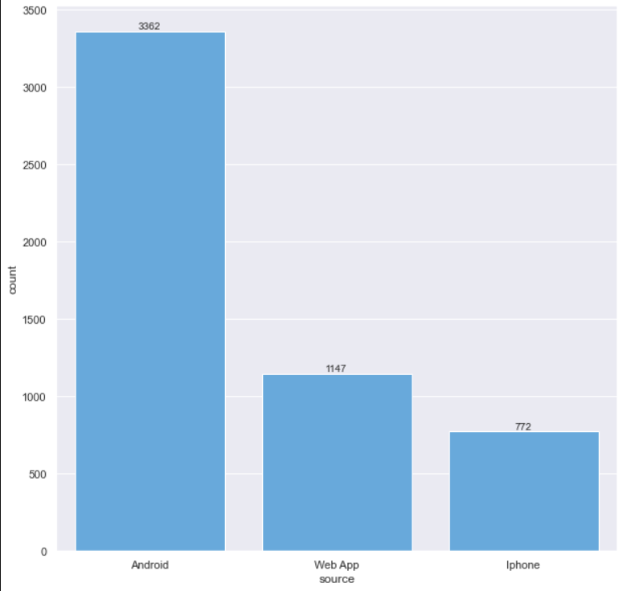
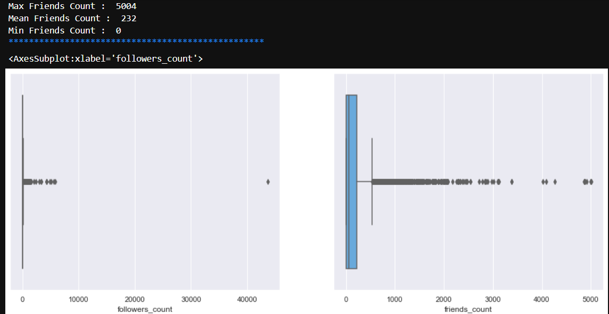
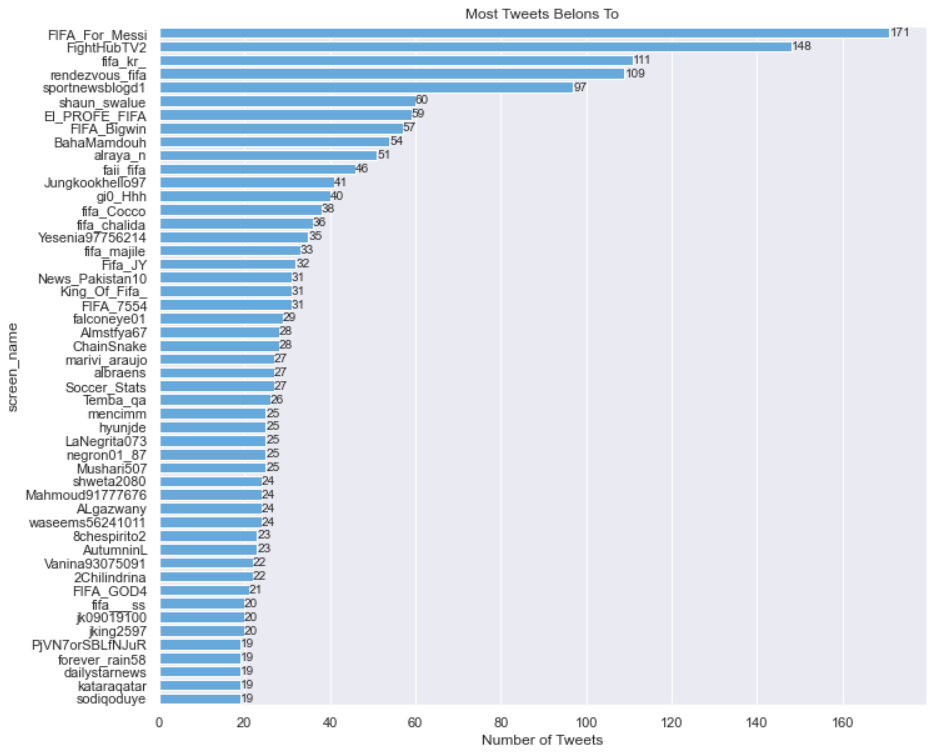
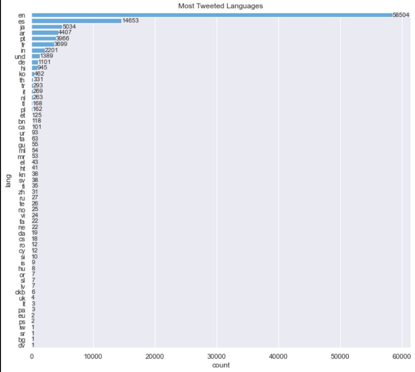

# Collect And Exploratory Data Analysis Qatar World Cup Tweets
In this project, I analyzed the data collected from tweets related to the World Cup hashtag using the Twitter API. The purpose of this analysis is to get to know the tweet pattern and find the trends of the Qatar World Cup.

## Project Overview 
  
  

- ### Collect data from Twitter
- ### Understanding the data
    - shape of the data
    - check column dtypes
    - check is there any null values
- ### Extract user mentioneds
- ### Top 20 most mentiond users
- ### Most tweets belongs to who ?
- ### Min and Max and Mean Retweet Count
- ### Min and Max and Mean Followers Count and Friends Count
- ### Which device are the most tweets done with ?
- ### Find accounts that created when world cup started
    - How many accounts were created during the World Cup ?
    - What's the language of recent accounts ? 
    - What places did they tweet from the most ?
    - Most used source for tweeting ?
    - What was the maximum number of followers they could attract during the World Cup?
